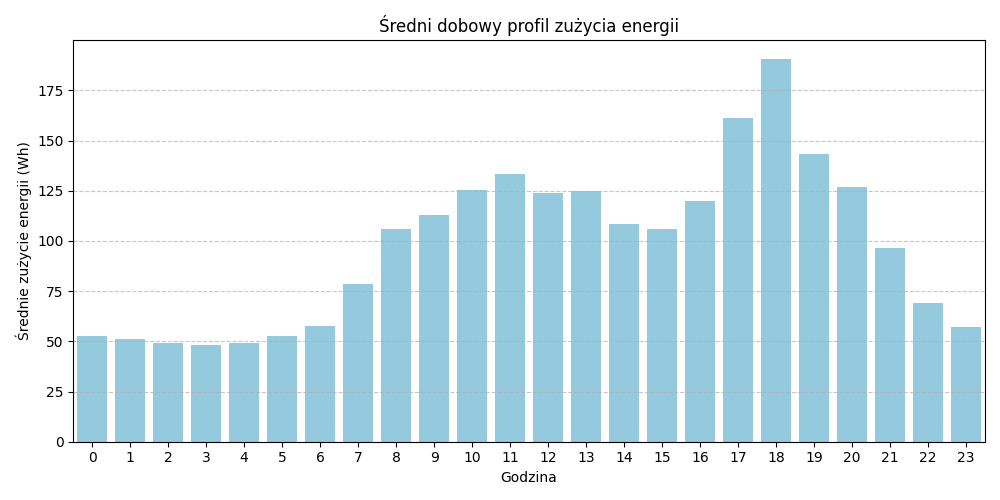
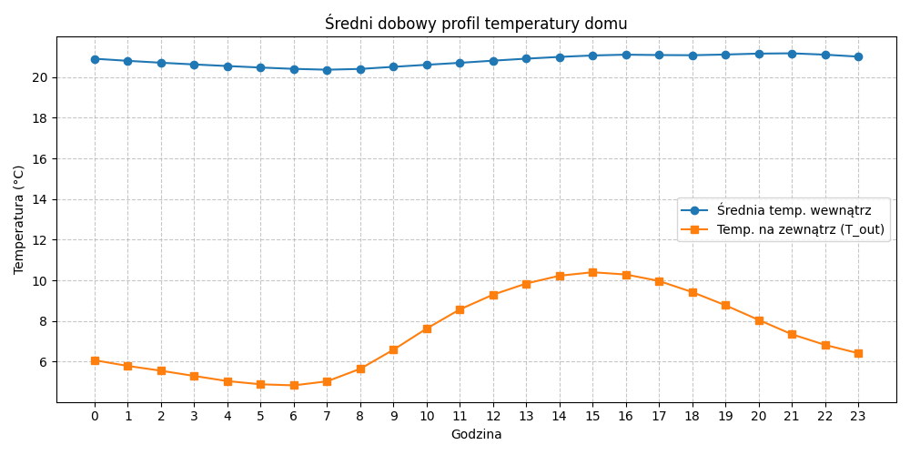
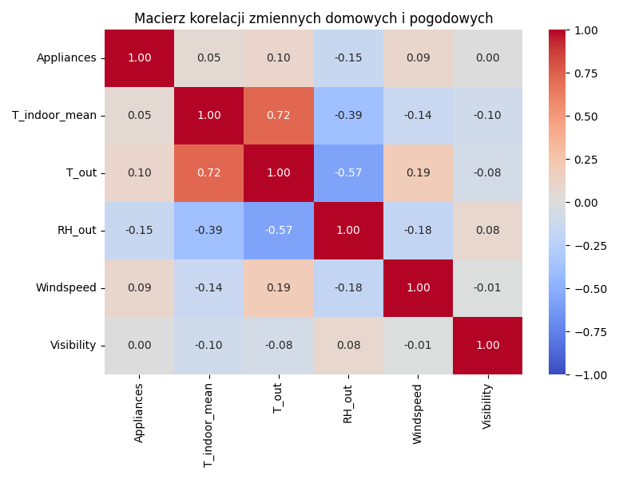

# Raport z analizy danych domowego systemu IoT

---

## 1. Wstęp i cel analizy
Celem niniejszego sprawozdania jest analiza profilu zużycia energii elektrycznej oraz warunków termicznych w inteligentnym budynku. Analiza opiera się na danych z czujników temperatury, wilgotności oraz liczników energii zbieranych w interwałach 10-minutowych.

## 2. Zużycie energii (Profil Dobowy)
Poniższy wykres przedstawia średnie zużycie energii przez urządzenia domowe (`Appliances`) w rozbiciu na godziny w ciągu doby.

### Wnioski:
* **Szczyt wieczorny:** Największe zużycie obserwuje się w godzinach od **17:00 do 20:00**. Sugeruje to wzmożoną aktywność domowników po powrocie z pracy/szkoły.
* **Baza nocna:** Między północą a 6:00 rano zużycie jest stabilne i niskie, co odpowiada pracy urządzeń w trybie standby (np. lodówka, router).

## 3. Analiza termiczna (Wewnątrz vs Zewnątrz)
Wykres porównuje średnią temperaturę odczytaną ze wszystkich czujników wewnątrz domu z temperaturą zewnętrzną podawaną przez stację pogodową.

### Wnioski:
* **Stabilność cieplna:** Pomimo wahań temperatury zewnętrznej, temperatura wewnątrz domu pozostaje w komforcie cieplnym (20-22°C).
* **Bezwładność:** Można zauważyć, że temperatura wewnątrz reaguje na zmiany zewnętrzne z pewnym opóźnieniem, co świadczy o dobrej izolacji budynku.

## 4. Korelacje i zależności
Macierz korelacji pozwala zidentyfikować, które czynniki zewnętrzne mają największy wpływ na zużycie energii oraz warunki wewnątrz.

### Kluczowe obserwacje:
* **Temperatura a Energia:** Czy istnieje silna zależność między temperaturą zewnętrzną a zużyciem urządzeń? (Tutaj wpisz własną obserwację na podstawie koloru na mapie ciepła).
* **Wilgotność:** Warto zwrócić uwagę na korelację między wilgotnością zewnętrzną a temperaturą punktu rosy.

## 5. Podsumowanie
Analiza wykazała, że system IoT dostarcza precyzyjnych informacji o nawykach domowników. Optymalizacja zużycia energii powinna skupić się na godzinach wieczornych, np. poprzez przesunięcie pracy energochłonnych urządzeń (zmywarka, pralka) na godziny nocne lub okołopołudniowe (jeśli dom posiada instalację fotowoltaiczną).

---
